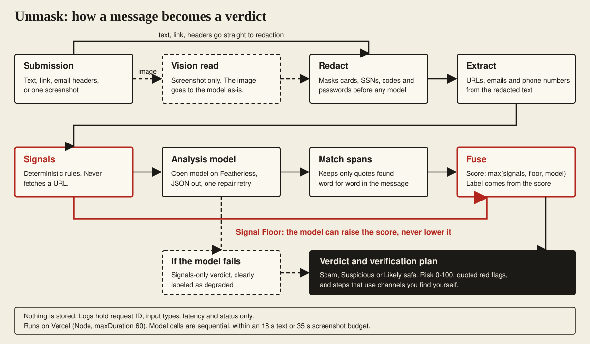
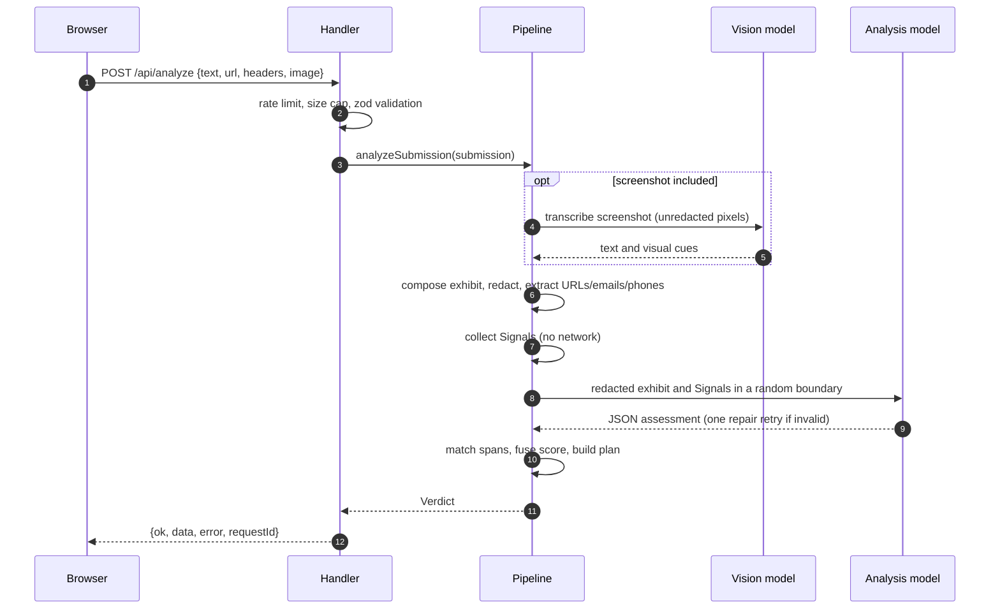

# Architecture

Unmask is one Next.js app. The browser posts a **Submission** to a single route, `POST /api/analyze`, and gets back a **Verdict** in a standard envelope. Everything is stateless: there is no database, queue or cache. Vocabulary follows [CONTEXT.md](CONTEXT.md). A picture version is in [docs/architecture.svg](docs/architecture.svg).

## Components

| Component | Where | Responsibility |
|---|---|---|
| UI | `src/app/page.tsx`, `src/components/` | Checker form, sample gallery, annotated Exhibit, verdict, recovery panel, safe-word card. Resizes screenshots client-side (max 1600 px JPEG, aimed at 1.5 MB). |
| Route | `src/app/api/analyze/route.ts` | Thin wrapper around the handler. `maxDuration = 60`. |
| Handler | `src/lib/server/handler.ts` | Rate limit, size check, JSON parse, zod validation, response envelope, request ID, logging. |
| Pipeline | `src/lib/analyze/analyze.ts` | `analyzeSubmission`: vision, redaction, signals, model call with one repair retry, fusion, spans. The model is injected, so tests use a mock. |
| Signals | `src/lib/signals/` | Pure, deterministic checks (url, text, headers, injection, combinations, brand list). |
| Redaction | `src/lib/redact/redact.ts` | Masks card (Luhn), SSN, IBAN, routing, account, codes, passwords. |
| Evidence extraction | `src/lib/evidence/extract.ts` | Pulls URLs, emails and phone numbers from the redacted text. |
| Fusion | `src/lib/fuse/fuse.ts`, `spans.ts` | Risk score, Signal Floor, label, verbatim span matching. |
| Respond | `src/lib/respond/` | Verification plan, degraded fallbacks, static recovery steps, safe word. |
| Models | `src/lib/server/models.ts`, `mock.ts`, `env.ts` | Featherless provider (OpenAI-compatible) or the deterministic mock (`AI_MOCK=1`). |
| Contracts | `src/lib/domain/` | zod schemas for Submission, Signal, Verdict, plus the Scam Type list. |

Recovery Steps and the safe word are not part of the Verdict. They are static client-side content, so they work even when the API is down.

## Request data flow

1. **Ingest.** The handler rejects the request if the rate limit is hit (429), the body is over 4,400,000 bytes (413), the JSON is unreadable (400) or the zod schema fails (400). At least one of text, URL, headers or image is required.
2. **Vision (image only).** The screenshot goes to the vision model, which returns a verbatim transcription and visual cues. If it fails and there is other input, the check continues and the Verdict lists "The screenshot could not be read." as unverifiable. If the image was the only input, the route returns a 422 `image_unreadable` error and no Verdict.
3. **Redact.** Text, vision text and the URL are merged into one exhibit (headers only if nothing else was sent) and masked. Images are the one thing that cannot be masked (deviation D-1).
4. **Extract.** URLs, email addresses and phone numbers are taken from the redacted exhibit, so no Signal quote can carry unredacted PII.
5. **Signals.** Deterministic checks run over the exhibit, URLs, emails and parsed headers. Signals are deduplicated by id, sorted strongest first, and combination rules add extra hard Signals. URLs are never fetched.
6. **Analyze.** The analysis model sees only the redacted exhibit and the Signals, inside `<untrusted_message id=RANDOM>` tags. Delimiter-like tags in the message are neutralized first. Output is plain-text JSON, extracted and validated with zod. A `<think>` block is stripped. On a parse failure it retries once with a repair prompt, only if at least 5 s remain.
7. **Spans.** Red-flag quotes from Signals and the model are matched case-insensitively against the exhibit. Quotes that are not found verbatim are dropped.
8. **Fuse.** `riskScore = max(signalScore, signalFloor, modelRisk)`. The label comes from this score only.
9. **Respond.** The Verdict is assembled with a verification plan keyed to the scam type and a sanitized Claimed Identity, and returned with a request ID.

## Scoring rules

Severity weights: low 5, medium 15, high 30, hard 50. `signalScore` is the sum over unique Signal ids, capped at 100. Labels: 70 or more is **Scam**, 35 to 69 is **Suspicious**, below 35 is **Likely safe**.

| Signals present | Floor |
|---|---|
| Two or more hard, or one hard and one high | 70 (Scam) |
| One hard | 50 (Suspicious) |
| Any high | 35 (Suspicious) |
| Otherwise | 0 |

The model can raise the score above the floor but never lower it. The deliberate cost is that a legitimate message with one hard Signal shows as Suspicious ([ADR-0001](docs/adr/0001-signal-floor-over-model.md)).

| Signal id | Severity |
|---|---|
| `url.userinfo-trick`, `url.lookalike-domain` (exact character swap), `url.brand-in-subdomain` (non-common-word brand), `url.punycode` imitating a brand | hard |
| `url.lookalike-domain` (fuzzy), `url.brand-in-subdomain` (common-word brand such as apple, chase), `url.ip-host` | high |
| `url.punycode` (not imitating), `url.shortener`, `url.risky-tld`, `url.user-content-on-official` | medium |
| `url.excess-subdomains` | low |
| `text.gift-card-payment`, `text.credential-request`, `text.secrecy`, `text.remote-access`, `text.guaranteed-returns` | high |
| `text.crypto-payment`, `text.wire-p2p-payment`, `text.money-request`, `text.urgency`, `text.threat-authority`, `text.prize`, `text.job-pay`, `text.family-emergency` | medium |
| `header.display-name-brand-mismatch`, all `injection.*` | hard |
| `header.auth-fail` (SPF, DKIM or DMARC fail) | high |
| `header.reply-to-mismatch`, `phone.only-contact-channel` | medium |
| `header.return-path-mismatch` | low |
| `combo.payment-pressure`, `combo.credential-impersonation`, `combo.family-payment`, `combo.display-name-reply-to` | hard |

Combination rules: an untraceable payment plus urgency or secrecy; a credential or code request plus brand impersonation; a family emergency plus a payment request; a brand display name plus a Reply-To mismatch (deviation D-2: Reply-To alone is only medium).

Detail worth knowing: brand matching uses whole dot- or hyphen-delimited tokens, so `secure-chase-alerts.top` matches and `purchase.example.com` does not. User-content hosts (for example `web.app`, `github.io`) are never treated as official. The credential-request rule ignores hits inside "do not share this code" sentences. Injection matching normalizes text first (NFKC, zero-width and bidi removal, homoglyph folding) and decodes base64 blobs of 16 or more characters.

## Failure modes and degraded verdicts

| Situation | Result |
|---|---|
| Model key missing and mock off | 200 with a degraded Verdict, `not_configured` |
| Provider error (non-429) | degraded, `provider_error` |
| HTTP 429 from the provider | degraded, `rate_limited` |
| Model call exceeds its time budget | degraded, `timeout` |
| Invalid JSON twice, or too little time left to retry | degraded, `parse_failed` |
| Vision fails, other input present | normal Verdict, screenshot listed as unverifiable |
| Vision fails, image is the only input | 422 `image_unreadable`, no Verdict |
| Caller exceeds the per-IP limit | 429 `rate_limited` with `Retry-After` (this is Unmask's own limit, not the provider's) |
| Body too large | 413 `payload_too_large` (the client also maps Vercel's non-JSON 413) |
| Bad input | 400 `invalid_input` |
| Unexpected exception | 500 `internal_error` |

A degraded Verdict has `degraded: true` and a `degradedReason`. The scam type is inferred from Signals, the summary is templated from the top Signals, and the UI labels it as rules-only. The verification plan and recovery steps are always available.

## Limits and budgets

| Item | Limit |
|---|---|
| Text | 10,000 characters |
| Email headers | 20,000 characters |
| URL | 2,048 characters |
| Image | PNG, JPEG or WebP data URL, up to 4,000,000 characters (about 3 MB decoded) |
| Request body | 4,400,000 bytes (Vercel cap is 4.5 MB) |
| Request deadline | 18 s text only, 35 s with a screenshot |
| Vision call | at most 15 s |
| Repair retry | only if at least 5 s remain |
| Model output | analysis up to 900 tokens, vision up to 1,500, temperature 0.1 and 0 |
| Rate limit | `RATE_LIMIT_PER_MINUTE` per IP, default 10, in-memory sliding window |

Model calls are sequential (Featherless concurrency units) and make no automatic SDK retries (`maxRetries: 0`).

## Deployment

Target: Vercel, Node.js runtime. The route sets `export const maxDuration = 60`. Set `FEATHERLESS_API_KEY` (and optionally `VISION_MODEL`, `ANALYSIS_MODEL`, `RATE_LIMIT_PER_MINUTE`) in the project environment. `AI_MOCK=1` is refused when `VERCEL_ENV=production`. Security headers (CSP, HSTS, nosniff, `X-Frame-Options: DENY`, referrer and permissions policies) are set in `next.config.ts`. CI (`.github/workflows/ci.yml`) runs lint, typecheck, coverage, build, a client-bundle secret grep, Playwright, and gitleaks over full history. See [docs/RUNBOOK.md](docs/RUNBOOK.md) for operations.

## Decisions

- [ADR-0001: Deterministic signals set a floor under the model's verdict](docs/adr/0001-signal-floor-over-model.md)
- [ADR-0002: Open-weight models via Featherless instead of a frontier API](docs/adr/0002-featherless-open-models.md)
