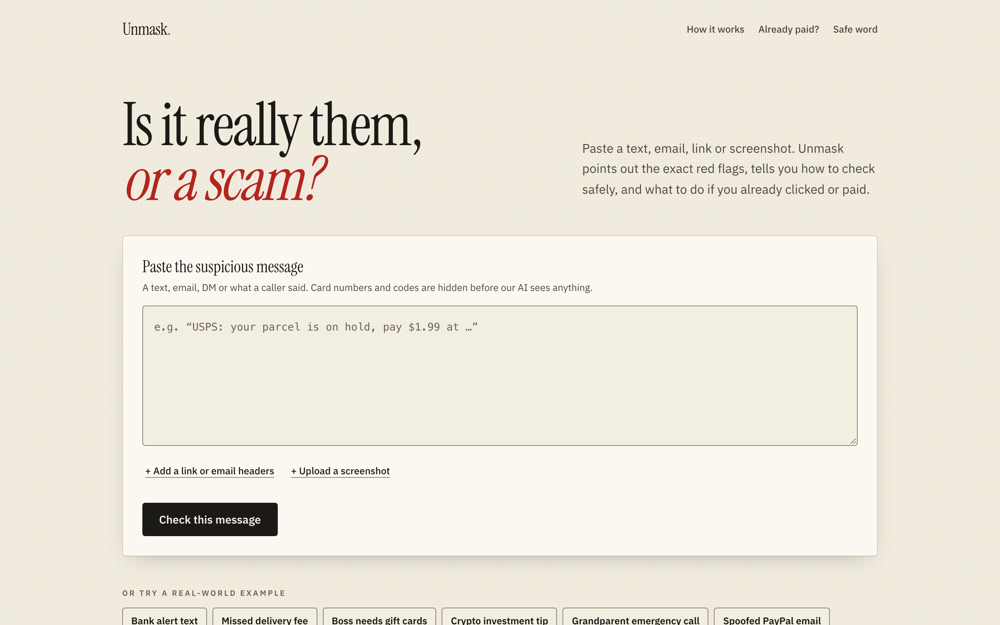
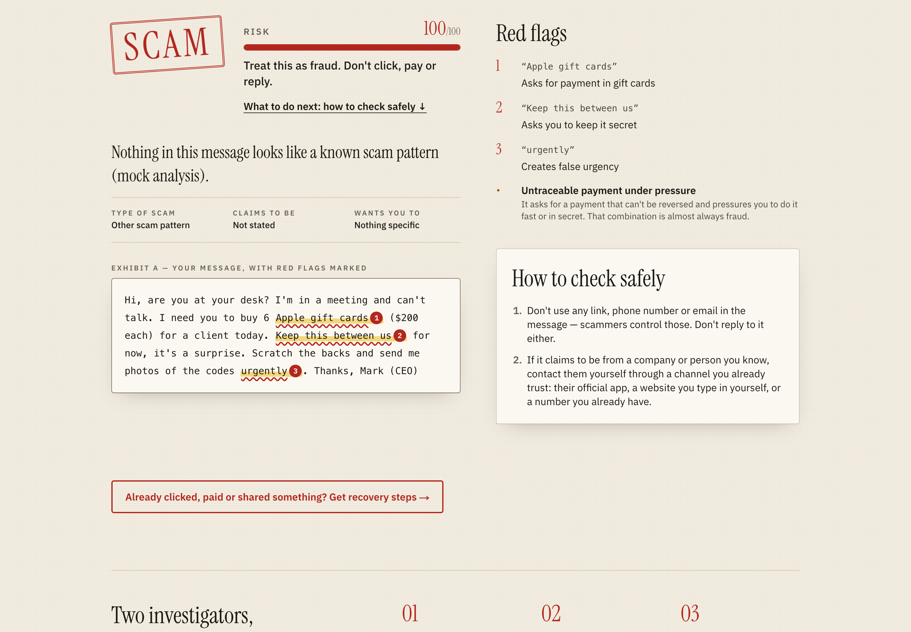
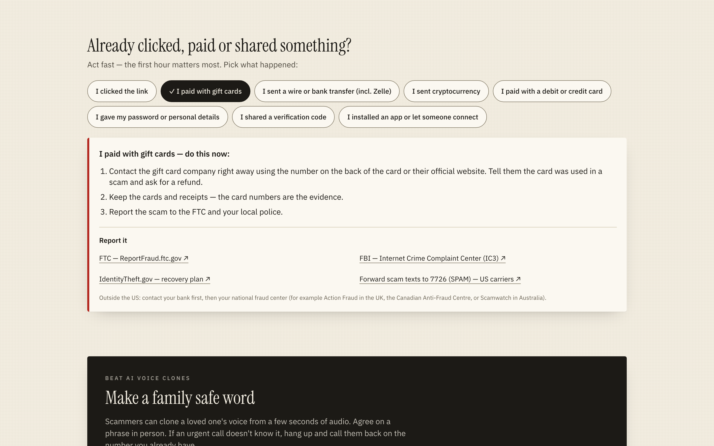

# Unmask: user guide

Unmask is a website that gives you a second opinion on a message you are unsure about. It works for texts, emails, direct messages, links, screenshots, and even what a caller said. It tells you whether the message looks like a scam, shows you the exact words that worry it, and explains how to check safely. If you already clicked or paid, it tells you what to do next.

Unmask gives advice. It cannot promise that a message is safe or that it is a scam. When in doubt, check with the real company or person yourself, using a phone number or website you already trust.

## Check a message in four steps

1. **Paste the message** into the big box. For a phone call, type or paste what the caller said.
2. **Add more if you have it (optional).**
   - "+ Add a link or email headers" opens two extra boxes. Paste the link from the message (Unmask never opens it). Email headers are the technical details your email program shows under "Show original". Most people can skip them.
   - "+ Upload a screenshot" lets you add a picture of the message instead of typing. Unmask shrinks it on your device first.
3. **Press "Check this message".** You will see short progress notes while it works. It can take several seconds, and you can press Cancel at any time.
4. **Read the result.** The page scrolls to it.

Just want to see how it works? Under the box, press one of the examples, such as "Bank alert text" or "Boss needs gift cards". One of them, "Real 2FA code (legit)", is a genuine message, so you can see what a safe result looks like.

## Reading the result

The result has a stamp and a score from 0 to 100. A higher score means more likely fraud.

| Stamp | What it means | What to do |
|---|---|---|
| **Scam** | Strong signs of fraud. | Do not click, pay or reply. |
| **Suspicious** | Some warning signs. | Do not act on it until you have checked it yourself. |
| **Likely safe** | No scam signs found. That is not a guarantee. | Stay careful with links and payments. |

Below the stamp you will see:

- **A short summary** in plain words.
- **Type of scam, Claims to be, Wants you to.** Who the message pretends to be and what it wants from you.
- **Your message with the red flags marked.** Suspicious words are highlighted, underlined and numbered, so you do not have to rely on colour. Each number matches an explanation in the "Red flags" list. Only words that really appear in your message are marked.
- **How to check safely.** Steps that use a phone number, app or website that you find yourself, never one from the message.
- **What we couldn't verify.** Things nobody can confirm from the message alone, such as who really sent it.

You may also see these notes:

- **"We hid some sensitive values."** Card numbers, social security numbers, bank account numbers, codes and passwords are covered up before the AI reads your message.
- **"Don't call the number in this message."** Scammers answer those numbers. Look up the official one yourself.
- **A yellow notice that the AI analyst is unavailable.** The result then comes from fixed checks only and may miss subtle scams. Treat it with extra care, or try again in a minute.

## Already clicked, paid or shared something?

Act quickly. The first hour matters most. Press "Already clicked, paid or shared something? Get recovery steps" under a result, or use "Already paid?" at the top of the page.

Pick what happened:

- I clicked the link
- I paid with gift cards
- I sent a wire or bank transfer (including Zelle)
- I sent cryptocurrency
- I paid with a debit or credit card
- I gave my password or personal details
- I shared a verification code
- I installed an app or let someone connect

You get a short list of steps in order, plus links to report the scam: the FTC (ReportFraud.ftc.gov), the FBI's Internet Crime Complaint Center (IC3), and IdentityTheft.gov. Outside the US, call your bank first and then your national fraud center. Unmask does not report anything for you.

## Make a family safe word

Scammers can copy a loved one's voice from a few seconds of recording and phone you with a fake emergency. A safe word protects you.

1. Go to "Safe word" at the top of the page and press "Generate a safe word". You get a three-word phrase, such as "golden otter teapot". Press "Generate another" until you like one.
2. Agree on it with your family **in person**. Never send it by text or email.
3. If someone calls with an urgent request for money and does not know the word, hang up. Call that person back on the number you already have.

The phrase is made on your own device. It is not sent anywhere.

## Your privacy

- Unmask does not keep your messages. There are no accounts and no history.
- Card numbers, codes and passwords are hidden before the AI reads your text.
- **Screenshots are different.** They are sent to the AI as they are, because pictures cannot be blurred automatically. Crop out card numbers and codes first.
- Unmask never opens the links you give it.

## If something goes wrong

| What you see | What to do |
|---|---|
| "Paste a message, a link, email headers or a screenshot to check." | The box was empty. Add something and try again. |
| "That's too large to check." | Use a shorter message or a smaller screenshot. The limit is 10,000 characters of text. |
| "Too many checks in a short time. Please wait a minute and try again." | Wait a minute. |
| "We couldn't read that screenshot. Try pasting the message text instead." | Type or paste the words from the picture. |
| A notice that the AI analyst is unavailable | The result still works but is less thorough. Try again later. |

Your message stays in the box when an error appears, so you will not have to retype it.
